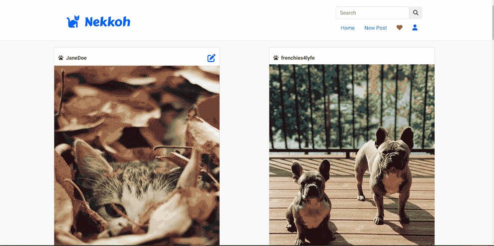

# Nekkoh

A full stack web application for pet owners/lovers who want to share photos of their pets.

## Why I Built This

I enjoy sharing pictures of my pets and I love viewing pet-related profiles in socia media. I wanted to learn and build a full stack CRUD that related to my interest.

## Technologies Used
- React.js
- Webpack
- Bootstrap 5
- Node.js
- HTML5
- CSS3
- Dokku

## Live Demo

Try the application live at [https://nekkoh.com/](https://nekkoh.com/)

## Features

- User can view a gallery of pet photos
- User can post their own photo
- User can update the content of their own post
- User can delete their own post
- User can comment on a post
- User can delete their comment on a post

## Stretch Features

- User will be able to search for another user's posts
- User will be able to view their profiles
- User will be able to like posts

## Preview



## Development

### System Requirements
- Node.js 18 or higher
- NPM 8 or higher

### Getting Started
1. Clone repository
```shell
git clone git@github.com:arcan9/nekkoh.git
cd nekkoh
```
2. Install all dependencies with NPM
```shell
npm install
```
3. Create the database
```shell
createdb nekkohApp
```
4. Import the example database to PostgreSQL
```shell
npm run db:import
```
5. To examine the database
```shell
pgweb --db=nekkohApp
```
6. Start the project
```shell
npm run dev
```

Once started you can view the app by opening http://localhost:3000 in your browser.

### S3 Bucket setup
In handling file uploads:

- You will need to login to the [AWS S3 console](https://console.aws.amazon.com/)
- Create a bucket for the app
- Have AWS create the following environment variables with your credentials:
```javascript
{
    AWS_S3_REGION=us-west-1
    AWS_S3_BUCKET=your-bucket-name
    AWS_ACCESS_KEY_ID=your-access-key-id
    AWS_SECRET_ACCESS_KEY=your-secret-access-key
}
```
